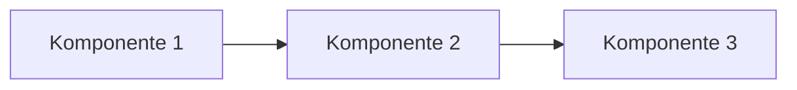

# Projektdokumentation

Diese Dokumentation beschreibt Planung, Aufbau, Umsetzung, Tests und Reflexion des Projekts.  
Sie ist so strukturiert, dass eine aussenstehende Fachperson den Ablauf vollständig nachvollziehen kann.

---

# 1. Einleitung

Dieses Projekt wurde im Rahmen des Moduls 346 umgesetzt und behandelt die Entwicklung eines einfachen FaceRecognition-Services in der AWS-Cloud. Dabei wird ein Bild in einen S3-Bucket hochgeladen, automatisch durch eine Lambda-Funktion verarbeitet und mit Amazon Rekognition analysiert. Das Ergebnis – die erkannten Personen und deren Wahrscheinlichkeit – wird als JSON-Datei in einem zweiten Bucket gespeichert.

Ziel war es, eine funktionierende technische Lösung zu erstellen, die den gesamten Cloud-Ablauf demonstriert und gleichzeitig die Kriterien des Moduls erfüllt: eine klare Architektur, eine automatisierte Bereitstellung mittels Init-Script, eine korrekte Implementierung der Lambda-Funktion sowie aussagekräftige Tests mit Dokumentation.

---

# 2. Architektur und Konzept

In diesem Kapitel wird das technische Konzept erläutert.  
Die eingesetzten Komponenten werden erklärt und ihr Zusammenspiel dargestellt.

## 2.1 Systemübersicht



## 2.2 Komponentenbeschreibung

| Komponente | Beschreibung | Zweck |
|-----------|--------------|-------|
| Komponente 1 | Erklärung | Aufgabe |
| Komponente 2 | Erklärung | Aufgabe |
| Komponente 3 | Erklärung | Aufgabe |

---

# 3. Umsetzung

Dieses Kapitel dokumentiert die Implementierung.

## 3.1 Implementierungsdetails

```code
# Beispielcode
print("Hallo Welt")
```

## 3.2 Wichtige Entscheidungen

- Entscheidung 1 – Begründung  
- Entscheidung 2 – Begründung  
- Entscheidung 3 – Begründung  

---

# 4. Installation und Verwendung

Hier wird beschrieben, wie die Lösung installiert, gestartet und ausgeführt wird.

## 4.1 Voraussetzungen

- benötigte Software  
- Systemumgebung  
- weitere Abhängigkeiten  

## 4.2 Installation

```bash
git clone <repo-url>
cd projekt
./install.sh
```

## 4.3 Starten der Anwendung

```bash
./start.sh
```

---

# 5. Tests und Ergebnisse

Alle Testfälle wurden durchgeführt und protokolliert.

## 5.1 Testübersicht

| Testfall | Beschreibung | Erwartet | Ergebnis | Screenshot |
|----------|--------------|----------|----------|-------------|
| Test 1 | Erklärung | Erwartung | erfolgreich | test1.png |
| Test 2 | Erklärung | Erwartung | erfolgreich | test2.png |
| Test 3 | Erklärung | Erwartung | erfolgreich | test3.png |

## 5.2 Beispielauswertung

```json
{
  "status": "ok",
  "details": "Beispielresultat"
}
```

## 5.3 Fazit

- Test 1: erfolgreich  
- Test 2: erfolgreich  
- Test 3: erfolgreich  

---

# 6. Aufgabenverteilung

| Teammitglied | Aufgabe | Anteil |
|--------------|---------|--------|
| Person A | Implementierung | 40% |
| Person B | Dokumentation & Tests | 35% |
| Person C | Konzept & Architektur | 25% |

---

# 7. Reflexion

## 7.1 Persönliche Reflexionen

### Person A
- positive Punkte  
- Herausforderungen  
- Verbesserungspotential  

### Person B
- positive Punkte  
- Herausforderungen  
- Verbesserungspotential  

### Person C
- positive Punkte  
- Herausforderungen  
- Verbesserungspotential  

## 7.2 Gesamtreflexion

- Was gut funktionierte  
- Was verbessert werden könnte  
- Erkenntnisse für zukünftige Projekte  

---

# 8. Quellen und Anhänge

## 8.1 Quellen

- Dokumentationen  
- Onlineresearch  
- weitere Ressourcen  

## 8.2 Anhänge

- zusätzliche Diagramme  
- Screenshots  
- ergänzende Dateien  
